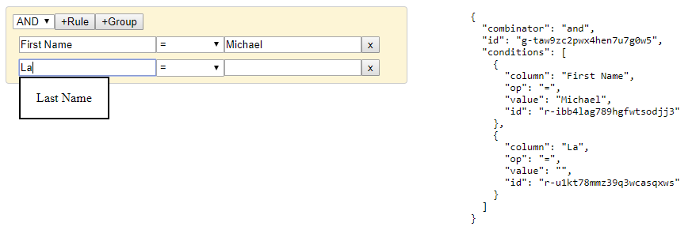
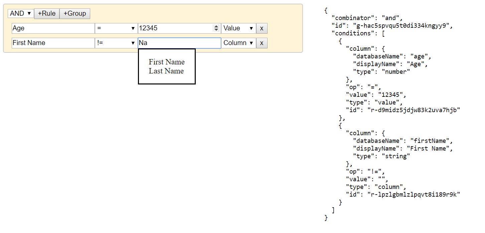

# React Query Builder TS

Highly dynamic React Query Builder Component written in typescript.

## Credits

This Typescript Query builder component is heavily inspired by sapientglobalmarkets' Query Builder:

- [React Querybuilder](https://github.com/sapientglobalmarkets/react-querybuilder)

## Getting Started



```shell
npm install react-querybuilder-ts --save
```

## Demo

To run a demo of the react-querybuilder being used, clone the project and run yarn install in both the root and example folders.

- In the root directory `yarn install` and `yarn start`
- wait until the root directory finishes compiling
- In the example directory `yarn install`and `yarn start`
- Open brower and go to `http://localhost:1234/`

OR

[See live demo](https://the-speck.github.io/query-builder-ts/)

# Usage

## Minimal Default Example

```jsx
import QueryBuilder from 'react-querybuilder-ts';

const App = () => {
  const columns = [
    { name: 'firstName', label: 'First Name' },
    { name: 'lastName', label: 'Last Name' },
  ];

  const handleOnQueryChange = query => {
    console.log(query);
  };

  return <QueryBuilder columns={columns} onQueryChange={handleOnQueryChange} />;
};

ReactDOM.render(<App />, document.getElementById('root'));
```

---

## Advanced Customization Example

User created elements will deep merge with the default elements. Columns may be provided directly to the elements as options and can be any array type. `mapInput` and `mapOutput` allow for the transformation of the values passed in and out, respectively. `condition` allows the user to hide components.

```jsx
import QueryBuilder from 'react-querybuilder-ts';

const App = () => {
  const columns = [
    { databaseName: 'firstName', displayName: 'First Name', type: 'string' },
    { databaseName: 'lastName', displayName: 'Last Name', type: 'string' },
    { databaseName: 'address', displayName: 'Address', type: 'string' },
    { databaseName: 'age', displayName: 'Age', type: 'number' },
  ];

  const handleOnQueryChange = query => {
    console.log(query);
  };

  return (
    <QueryBuilder
      onQueryChange={setQuery}
      rules={{
        columnSelector: {
          component: ValueComboBox,
          name: 'column',
          className: {
            input: '',
            dropdownContainer: 'filteredOptionsContainer',
            container: 'comboBoxContainer',
            ul: 'filteredOptionsList',
            li: 'filteredOptionsItem',
          },
          options: columns,
          position: 1,
          defaultValue: {},
          mapInput: (value, props) => value.displayName || '',
          mapOutput: (value, props) =>
            columns.find(c => c.displayName === value) || '',
        },
        valueInput: {
          component: ValueInput,
          name: 'value',
          className: '',
          label: 'Value',
          position: 3,
          defaultValue: '',
          inputType: (value, props) => props.parentProps.rule.column.type,
          condition: ({ parentProps }: ControlProps): boolean =>
            parentProps.rule.op !== 'null' &&
            parentProps.rule.op !== 'notNull' &&
            parentProps.rule.type !== 'column',
        },
        valueSelector: {
          component: ValueComboBox,
          name: 'value',
          className: {
            input: '',
            dropdownContainer: 'filteredOptionsContainer',
            container: 'comboBoxContainer',
            ul: 'filteredOptionsList',
            li: 'filteredOptionsItem',
          },
          position: 3,
          defaultValue: '',
          options: columns,
          condition: ({ parentProps }: ControlProps): boolean =>
            parentProps.rule.op !== 'null' &&
            parentProps.rule.op !== 'notNull' &&
            parentProps.rule.type === 'column',
          mapInput: (value, props) => value.displayName || '',
          mapOutput: (value, props) =>
            columns.find(c => c.displayName === value) || '',
        },
        typeSelector: {
          component: ValueDropDown,
          name: 'type',
          options: [
            { name: 'column', label: 'Column' },
            { name: 'value', label: 'Value' },
          ],
          className: 'dropdown',
          position: 4,
          defaultValue: 'value',
        },
      }}
    />
  );
};

ReactDOM.render(<App />, document.getElementById('root'));
```

Output:


### API

The columns passed as props to the `QueryBuilder` component are assigned the `columnSelector` but it is not required if you want to customize the elements and pass the options directly to the elements. The `name` attribute for the elements is required and corresponds to the key name in the query condition (see below for reserved names). The `component` corresponds to the component that will render. These are available as imports. The default export is a React Component `QueryBuilder` with default component controls `ValueComboBox`, `ValueInput`, `ValueDropDown` and `ActionButton`. Users are not restricted to the default provided components. Types are also exposed for Typescript users.

#### Default Rule Group Elements

```tsx
{
  combinatorSelector: {
    component: ValueDropDown,
    name: 'combinator',
    options: [
      { name: 'and', label: 'AND' },
      { name: 'or', label: 'OR' },
    ],
    className: '',
    position: 1,
    defaultValue: '='
  },
  addRuleAction: {
    component: ActionButton,
    name: 'addRule',
    label: '+Rule',
    className: '',
    position: 97,
  },
  addGroupAction: {
    component: ActionButton,
    name: 'addGroup',
    label: '+Group',
    className: '',
    position: 98,
  },
  removeGroupAction: {
    component: ActionButton,
    name: 'removeGroup',
    label: 'X',
    className: '',
    position: 99,
    condition: ({ parentProps }: ControlProps): boolean =>
      (parentProps as RuleGroupProps).level > 0
  },
}
```

Required: `addRuleAction`, `addGroupAction`, `removeGroupAction`

Reserved Names: `conditions`, `id`

#### Default Rule Elements

```tsx
{
  columnSelector: {
    component: ValueComboBox,
    name: 'column',
    className: '',
    position: 1,
    defaultValue: '',
  },
  operatorSelector: {
    component: ValueDropDown,
    name: 'op',
    options: [
      { name: 'null', label: 'Is Null' },
      { name: 'notNull', label: 'Is Not Null' },
      { name: 'in', label: 'In' },
      { name: 'notIn', label: 'Not In' },
      { name: '=', label: '=' },
      { name: '!=', label: '!=' },
      { name: '<', label: '<' },
      { name: '>', label: '>' },
      { name: '<=', label: '<=' },
      { name: '>=', label: '>=' },
    ],
    className: '',
    position: 2,
    defaultValue: '=',
  },
  valueInput: {
    component: ValueInput,
    name: 'value',
    className: '',
    label: 'Value',
    position: 3,
    defaultValue: '',
    condition: ({ parentProps }: ControlProps): boolean =>
      (parentProps as RuleProps).rule.op !== 'null' &&
      (parentProps as RuleProps).rule.op !== 'notNull'
  },
  removeRuleAction: {
    component: ActionButton,
    name: 'removeRule',
    label: 'x',
    className: '',
    position: 99,
  },
}
```

Required: `removeRuleAction`

Reserved Names: `id`

#### Build your own Element

```tsx
  // classname info types for the code below
  type MultiTypeClassName = string | string[] | (...arg: any[]) => string | string[];
  interface MultiTypeClassNameObject {
    [element: string]: MultiTypeClassName;
  }
  type ControlElementClassNames = MultiTypeClassNameObject | MultiTypeClassName;
```

```tsx
  {
    component: React.FunctionComponent<any> | React.ComponentClass<any>;
    name: string; // Except 'conditions' | 'combinator' | 'id'
    className?: ControlElementClassNames // Object type is used for ComboBox due to nested React elements
    options?: any[];
    label?: string;
    position?: number;
    condition?: (props: any) => boolean;
    defaultValue?: string;
    mapInput?: (value: any, props: ControlProps) => any;
    mapOutput?: (value: any, props: ControlProps) => any;
    debounceTime?: number; // For ValueComboBox and ValueInput
    inputType?: string | (value: any, props: ControlProps) => string; // For ValueComboBox and ValueInput
  }
```

#### Modify Overall Query Builder ClassNames

```tsx
  {
    queryBuilder?: MultiTypeClassName;

    ruleGroup?: MultiTypeClassName;
    ruleGroupRow?: MultiTypeClassName;

    ruleRow?: MultiTypeClassName;
  }
```

## Things You Should Know

- All the css classes and styling are very basic and minimal. This library assumes you'll apply your own styling to fit your application.
